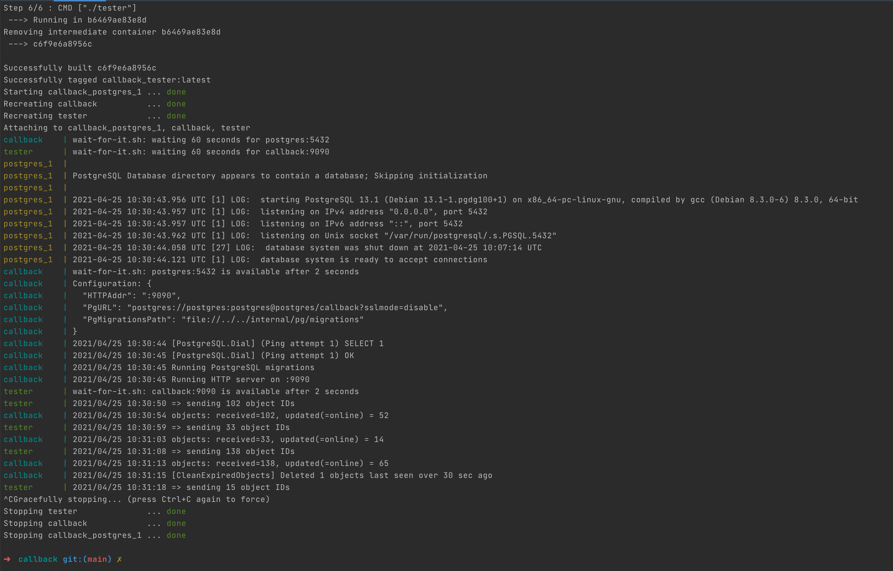

# Description

Let’s say GogoApps is building an awesome space visualization tool. In order to accomplish this task a
beautiful database of space pictures and videos is required. Such database is going to be built using two
independent microservices.
A microservice that is able to download media files from provided urls and store them onto some
internal storage (called media-downloader)
A microservice that would prepare a list of urls for the first microservice to use (called url-collector)
While your teammates are building the media-downloader, your task is to create the latter - the urlcollector. You will be building a microservice responsible for gathering image URLs from the open NASA's APOD API.

# Requirements

## Functional
The solution should consist of a HTTP server with one HTTP endpoint available. Endpoint should be
exposed under following path:

        GET /pictures?start_date=2020-01-04&end_date=2020-02-05

Since the NASA API publishes one image per day the start_date and end_date parameters define
range of pictures to be processed. Expected response from the endpoint should be a valid JSON message
containing all the urls in the following format:

        {“urls”: ["https://apod.nasa.gov/apod/image/2008/AlienThrone_Zajac_3807.jpg", ...]}

In case of an error the server is asked to return an appropriate HTTP status code and a descriptive JSON
message in the following format:

        {“error”: “error message”} .

As the provided date range in a single request might be broad, the NASA API should be queried
concurrently. However, in order not to be recognized as a malicious user, a limit of concurrent
requests to this external API must exist. Bear in mind, that this limit should never be exceeded
regardless of how many concurrent requests is the url-collector receiving.

## Non-functional
There should be some unit tests - no need to test everything, pick just one component and test it
thoroughly.
start_date and end_date parameters should have some kind of validation - think of possible
corner cases (for example: start_date should be earlier than end_date )
The application should be configurable via environment variables. We should be able to provide
following variables on application startup:
1. api_key used for NASA API requests (variable name API_KEY, default: DEMO_KEY)
2. Limit of concurrent requests to NASA API (variable name CONCURRENT_REQUESTS, default: 5)
3. A port the server is running on (variable name PORT, default: 8080)
Provide a Dockerfile that can be used to build and run the application without having the Go
toolchain installed locally.

# NASA API

An example of usage of the NASA APOD API endpoint to be used in the project.

Sample request:

        GET https://api.nasa.gov/planetary/apod?api_key=DEMO_KEY&date=2019-12-06
        
note that DEMO_KEY is a valid key that can be used in development process

Sample response:

        HTTP/1.1 200 OK
        Connection: keep-alive
        Content-Encoding: gzip
        Content-Type: application/json
        Date: Mon, 10 Aug 2020 16:44:34 GMT
        X-RateLimit-Limit: 40
        X-RateLimit-Remaining: 33
        {
         "copyright": "Amir H. Abolfath",
         "date": "2019-12-06",
         "explanation": "(...)",
         "hdurl": "https://apod.nasa.gov/apod/image/1912/TaurusAbolfath.jpg",
         "media_type": "image",
         "service_version": "v1",
         "title": "Pleiades to Hyades",
         "url": "https://apod.nasa.gov/apod/image/1912/TaurusAbolfath1024.jpg"
        }
More details here (https://api.nasa.gov/).

# Place for discussion

An interesting part of this project is that it can be easily extended with some additional features or
changes to the current behaviour. All the points below are not to be implemented, but rather to be
thought about. Take a minute and think about how would your codebase change in following situations:
What if we were to change the NASA API to some other images provider?
What if, apart from using NASA API, we would want to have another microservice fetching urls from
European Space Agency. How much code could be reused?
What if we wanted to add some more query params to narrow down lists of urls - for example,
selecting only images taken by certain person. (field copyright in the API response)

